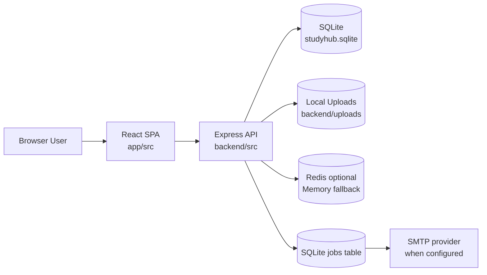
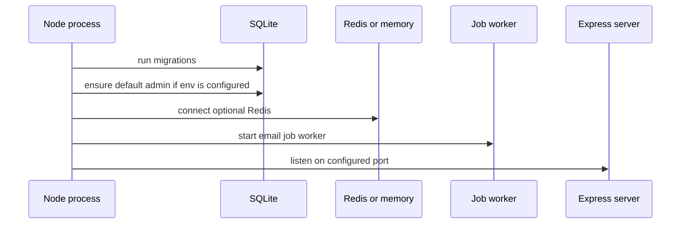
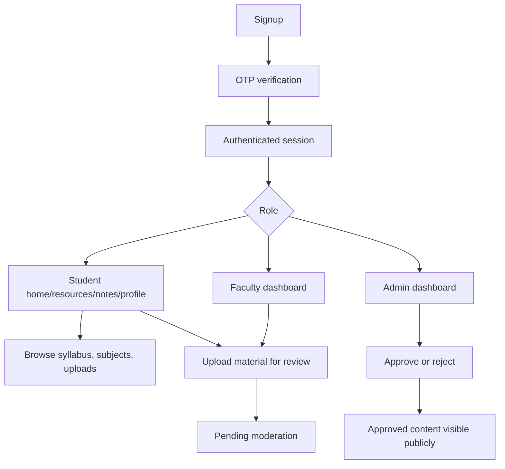

# System Architecture

NMU Study Hub is a React single-page app backed by an Express REST API and SQLite database.

## High-Level Architecture

## Repository Structure

| Path | Purpose | Launch note |
| --- | --- | --- |
| `app/` | Active React/Vite frontend. | Production frontend build comes from here. |
| `app/src/router.tsx` | Client-side route definitions. | Review route guards before launch. |
| `app/src/services` | Frontend API clients. | Error handling is inconsistent across services. |
| `backend/` | Active Express backend. | Deploy this backend, not `app/backend`. |
| `backend/src/app.js` | Express app composition. | Middleware and route mount source of truth. |
| `backend/src/server.js` | Long-running server entry point. | Runs migrations, seeds admin, connects cache, starts job worker. |
| `backend/api/index.js` | Serverless entry point. | Does not start listener or long-running worker. |
| `backend/migrations` | SQLite migrations. | Use controlled migration policy in production. |
| `backend/uploads` | Local runtime file storage. | Must move to object storage before real scaling. |
| `docs/` | Product and technical documentation. | Keep updated with code changes. |
| `app/backend/` | Legacy backend. | Remove or archive before launch to avoid confusion. |
| `backend/src/models` | Legacy Mongoose models. | Active backend does not use these models. |

## Frontend Architecture

### Core Stack

- React 19
- TypeScript
- Vite
- React Router
- Tailwind CSS 4
- Radix/shadcn-style components
- TipTap editor for notes/topic editing
- Sonner toasts
- Framer Motion and GSAP for UI animation

### Main Frontend Modules

| Module | Files | Responsibility |
| --- | --- | --- |
| Routing | `app/src/router.tsx` | Public, profile, notes, faculty, and admin routes. |
| Layout | `app/src/components/layout` | Navbar, footer, global layout. |
| Auth UI | `app/src/components/auth`, `app/src/pages/LoginPage.tsx`, `SignUpPage.tsx`, `VerifyOtpPage.tsx` | Login, signup, OTP, role redirect. |
| Academic browser | `StudyMaterialsPage`, `components/study` | Branch/semester/subject/unit/topic browsing. |
| Study stock | `StudyStockPage`, `services/study-service.ts` | Approved uploads, filters, bookmarks. |
| Syllabus | `SyllabusPage`, `SyllabusManagerPage`, `services/syllabus-service.ts` | Public syllabus and admin management. |
| Resources | `ResourceManagerPage`, `components/admin/ResourceForm.tsx` | Admin resource management. |
| Notes | `NotesPage`, `components/notes`, `components/editor` | Notion-style notes workspace. |
| Profile | `ProfilePage`, `FacultyProfile` | User profile, avatar, uploads, bookmarks. |
| Admin | `layouts/AdminLayout.tsx`, `pages/admin` | Admin dashboard and management screens. |
| Faculty | `layouts/FacultyLayout.tsx`, `pages/faculty` | Faculty dashboard, profile, upload workflow. |

### Frontend API Layer

| File | Responsibility |
| --- | --- |
| `api.ts` | Base URL, auth headers, asset URL helpers, subjects/topics, notes, preferences. |
| `study-service.ts` | Study-material listing, upload, moderation, bookmarks. |
| `resource-service.ts` | Resource CRUD. |
| `syllabus-service.ts` | Syllabus list/create/delete. |
| `faculty-service.ts` | Faculty stats and feedback. |
| `feedback-service.ts` | Platform feedback. |
| `admin-service.ts` | Admin stats/profile. |

## Backend Architecture

### Core Stack

- Node.js
- Express 5
- SQLite via `node:sqlite` `DatabaseSync`
- Zod validation
- JWT access and refresh tokens
- bcrypt password hashing
- Multer for uploads
- Helmet security headers
- CORS
- Redis optional cache
- Nodemailer email delivery

### Backend Middleware Pipeline

Actual order in `backend/src/app.js`:

1. Disable `x-powered-by`.
2. Parse JSON body with configured size limit.
3. Parse URL encoded body with configured size limit.
4. Sanitize request body/query/params with basic string cleanup.
5. Apply CORS using configured allowed origins.
6. Serve avatar uploads statically.
7. Serve resource uploads statically.
8. Serve syllabus uploads statically.
9. Apply Helmet.
10. Apply Morgan logging in development.
11. Mount `/api/v1` routes.
12. Apply 404 handler.
13. Apply global error handler.

Launch note: static resource/syllabus serving is convenient, but private or pending files should move behind signed URLs or authenticated proxy access.

### Backend Route Groups

| Base route | File | Responsibility |
| --- | --- | --- |
| `/api/v1/auth` | `authRoutes.js` | Register, login, OTP, refresh, logout, profile, avatar, preferences. |
| `/api/v1/admin` | `adminRoutes.js` | Stats, profile, students, faculty approval. |
| `/api/v1/resources` | `resourceRoutes.js` | Admin resources and uploaded resource files. |
| `/api/v1/study-materials` | `studyMaterialRoutes.js` | Uploads, moderation, bookmarks, faculty stats, feedback. |
| `/api/v1/syllabus` | `syllabusRoutes.js` | Syllabus list, create, delete, file streaming. |
| `/api/v1/files` | `fileRoutes.js` | Study-material file proxy. |
| `/api/v1/content` | `contentRoutes.js` | Secondary content upload/list/delete module. |
| `/api/v1/feedback` | `platformFeedbackRoutes.js` | Platform feedback. |
| `/api/v1/subjects` | `subjectRoutes.js` | Subjects by branch/semester. |
| `/api/v1/subjects/:id/units` | `subjectRoutes.js` | Units and nested topics. |
| `/api/v1/topics/:id` | `subjectRoutes.js` | Topic view/update. |
| `/api/v1/health` | `routes/index.js` | Health check. |

## Runtime Startup Flow

Serverless note: `backend/api/index.js` exports the Express app and does not start the long-running worker loop. Serverless deployment needs a separate worker or external email provider flow.

## Core Product Flow

## Deployment Shape Today

Local development:

- Frontend dev server: Vite.
- Backend server: Express long-running process.
- Database: local SQLite file.
- Uploads: local filesystem.
- Jobs: same backend process.

Production target:

- Frontend: static hosting or Vercel/Netlify.
- Backend: long-running Node service preferred unless storage/job architecture is redesigned.
- Database: managed SQL database or durable SQLite host with backups.
- Uploads: object storage.
- Cache/rate limit: Redis.
- Email: real SMTP/provider plus worker.

## Architecture Risks

| Risk | Current impact | Production recommendation |
| --- | --- | --- |
| SQLite synchronous access | Simple and fast locally, but single-process oriented. | Use controlled hosting and backups, or migrate to Postgres for scale. |
| Local uploads | Works locally, risky for serverless and multi-instance. | Use object storage. |
| Frontend stores access token in `localStorage` | XSS can steal access token. | Store access token in memory and rely on refresh cookie. |
| Legacy backend files remain | Confuses maintainers and deployment. | Remove or archive legacy code. |
| In-memory limiter/cache fallback | Not distributed. | Use Redis for production. |
| Build chunk size warnings | Slower first load. | Code split editor/admin/shiki-heavy routes. |
