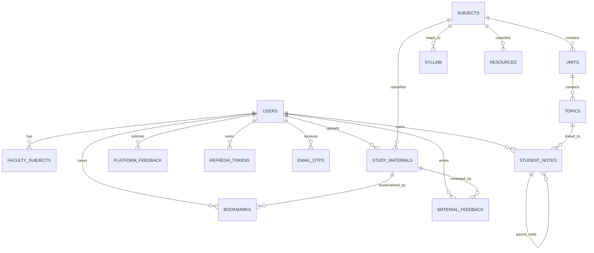

# Database Design

The active backend uses SQLite through Node `node:sqlite` `DatabaseSync`. The schema is managed through SQL migrations in `backend/migrations`.

## Database Location

Default path:

```text
backend/data/studyhub.sqlite
```

Override:

```text
DB_PATH=./data/studyhub.sqlite
```

## SQLite Startup Settings

Configured in `backend/src/config/database.js`:

- `PRAGMA foreign_keys = ON`
- `PRAGMA journal_mode = WAL`
- `PRAGMA synchronous = NORMAL`
- `PRAGMA busy_timeout = 5000`

## Migration Inventory

| Migration | Purpose |
| --- | --- |
| `001_initial` | Users, faculty subjects, subjects, syllabus, resources, study materials, refresh tokens, OTPs, jobs, and indexes. |
| `002_study_content_uploads` | Rebuilds `study_materials` with upload metadata. |
| `003_subjects_units_topics` | Adds units and topics. |
| `004_material_feedback` | Adds faculty/admin feedback for study materials. |
| `005_bookmarks` | Adds user bookmarks for study materials. |
| `006_study_content` | Adds secondary study content table. |
| `007_syllabus_year` | Adds academic year to syllabus. |
| `008_platform_feedback` | Adds user platform feedback. |
| `009_resource_file_uploads` | Adds upload metadata to resources. |
| `010_student_notes` | Adds personal student notes. |
| `011_user_preferences` | Adds JSON preferences to users. |
| `012_student_notes_metadata` | Adds note icons, covers, favorites, trash, page layout, and parent relationships. |

## Entity Relationship Diagram



## Core Tables

### `users`

Stores all accounts.

Important columns:

- `id`
- `first_name`
- `last_name`
- `email`
- `password_hash`
- `avatar_url`
- `role`
- `is_verified`
- `is_approved`
- `branch`
- `academic_year`
- `designation`
- `department`
- `college_name`
- `preferences`
- lifecycle timestamps

Concerns:

- `preferences` stores JSON text without schema validation.
- Email is globally unique, which is correct for login.
- Admin accounts are seeded, not registered publicly.

### `subjects`, `units`, `topics`

These tables power academic browsing:

- `subjects`: branch, semester, subject code, title.
- `units`: ordered unit records per subject.
- `topics`: Markdown topic content under a unit.

Concerns:

- Subject/unit/topic management is seed-script driven plus topic edit route.
- Full admin CRUD is missing.
- No full-text index exists for topic content.

### `syllabus`

Stores syllabus records.

Important columns:

- `subject_id`
- `title`
- `code`
- `branch`
- `semester`
- `academic_year`
- `type`
- `credits`
- `content_url`

Concerns:

- `credits` exists but create flow stores `0`.
- `content_url` is overloaded: it may be a local PDF path or raw Markdown content.

### `resources`

Stores admin-managed resources, links, and uploaded resource files.

Important columns:

- `title`
- `subject`
- `semester`
- `branch`
- `type`
- `description`
- `category`
- `pattern`
- `unit`
- `academic_year`
- `author`
- `url`
- `file_path`
- `original_filename`
- `mime_type`
- `file_size`
- `status`

Concerns:

- API can update resources, but UI edit workflow is incomplete.
- Resource list validation accepts pagination, but controller returns all matching records.
- Resource files are also served statically from `/uploads/resources`.

### `study_materials`

Stores user-submitted materials.

Important columns:

- `title`
- `subject`
- `type`
- `url`
- `file_path`
- `original_filename`
- `mime_type`
- `file_size`
- `status`
- `author`
- `uploader_user_id`
- `approved_by_user_id`
- `approved_at`
- `rejection_reason`

Concerns:

- No pagination for public approved, pending, or rejected lists.
- File type is inferred by extension, but MIME/content scanning is not implemented.
- No duplicate detection.

### `student_notes`

Stores user notes and page metadata.

Important columns:

- `user_id`
- `topic_id`
- `title`
- `content_markdown`
- `icon`
- `cover`
- `is_favorite`
- `is_trash`
- `parent_id`
- `font`
- `full_width`

Concerns:

- `parent_id` can point to another note, but there is no cycle prevention.
- Note metadata updates are unvalidated beyond controller logic.
- No conflict resolution for concurrent edits.

### `bookmarks`

Stores a user/material pair.

Concern:

- Bookmark delete is physical, unlike most other app records.

### `material_feedback`

Stores one review per reviewer and study material.

Important:

- `UNIQUE (study_material_id, reviewer_user_id)` prevents duplicate active rows.

Concern:

- The unique constraint does not account for soft-deleted rows, so re-creating after soft delete may need special handling.

### `refresh_tokens`

Stores rotating refresh-token sessions.

Important:

- Raw refresh tokens are not stored.
- `family_id` supports family revocation.
- `replaced_by_token_id` links rotations.

### `email_otps`

Stores hashed OTPs.

Important:

- OTP expiry is 10 minutes.
- Old unused OTPs are soft-deleted when a new OTP is generated.

### `jobs`

Stores background jobs such as `email.send`.

Current behavior:

- Long-running server starts the worker loop.
- Serverless entry point does not run a long-lived worker.

## Index Coverage

The schema includes indexes for:

- Users by role and email.
- Faculty subjects by faculty user.
- Subjects by branch and semester.
- Syllabi by branch, semester, and year.
- Resources by filters and status.
- Study materials by status and created date.
- Refresh tokens by user and family.
- OTPs by email and purpose.
- Jobs by status and availability.
- Feedback by material and reviewer.
- Notes by user/topic/deleted state.

## Database Concerns For Launch

| Concern | Risk | Recommendation |
| --- | --- | --- |
| SQLite file durability | Loss of data if filesystem is ephemeral. | Use durable volume or move to managed Postgres. |
| Automatic migrations on startup | Risky if migration fails during deploy. | Use explicit migration step in CI/CD. |
| No backup runbook | Data loss risk. | Define backup frequency, retention, restore drills. |
| No full-text indexes | Search slows as content grows. | Add SQLite FTS or external search. |
| Synchronous DB API | Blocks Node event loop during heavy queries. | Add pagination and consider async DB/Postgres for scale. |
| JSON preferences | No server-side schema. | Validate allowed preference keys. |
| Note tree cycles | Potential UI recursion issues. | Add cycle prevention before updating `parent_id`. |
