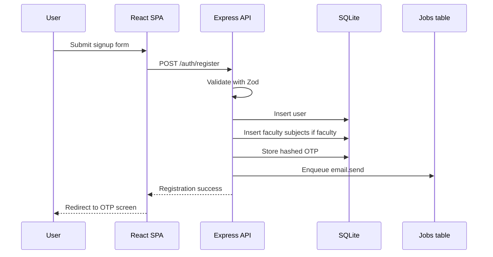
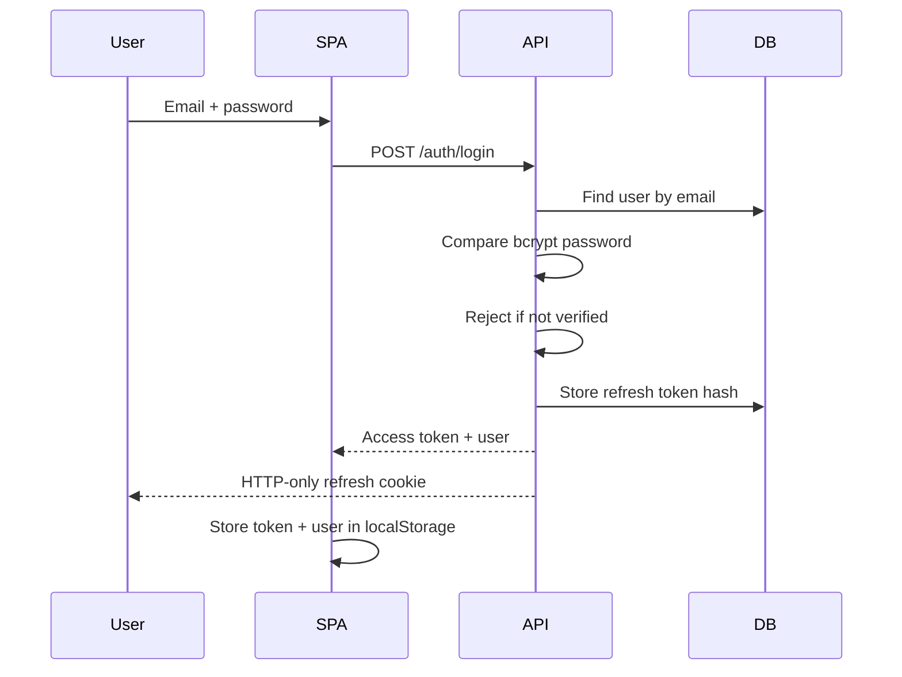

# Authentication And Session Management

NMU Study Hub uses email/password authentication, email OTP verification, JWT access tokens, and rotating refresh tokens.

## Main Files

| File | Purpose |
| --- | --- |
| `backend/src/controllers/authController.js` | Register, OTP, login, refresh, logout, profile, avatar, preferences. |
| `backend/src/routes/authRoutes.js` | Auth route definitions and auth rate limiting. |
| `backend/src/middlewares/authMiddleware.js` | Protect, optional auth, role authorization, faculty approval checks. |
| `backend/src/utils/authTokens.js` | Password hash, token hash, JWT sign/verify, OTP generation. |
| `backend/src/utils/cookies.js` | Refresh cookie set/clear/parse. |
| `app/src/hooks/use-local-auth.ts` | Local frontend auth state and `/auth/me` verification. |
| `app/src/components/auth/RoleGuard.tsx` | Redirect admin/faculty away from student home. |

## Registration Flow



Important behavior:

- Students start with `is_approved = 1`.
- Faculty start with `is_approved = 0`.
- Public signup cannot create admin users.
- OTP values are printed only outside production.

## OTP Verification Flow

1. User submits email and 6-digit OTP.
2. Backend finds the latest unused OTP for the email.
3. Backend checks expiry.
4. Backend hashes submitted OTP and compares hashes.
5. Backend marks OTP as used.
6. Backend sets `users.is_verified = 1`.
7. Backend creates an authenticated session.
8. Frontend stores access token and user object.

OTP settings:

| Setting | Current value |
| --- | --- |
| Length | 6 digits |
| Expiry | 10 minutes |
| Purpose | `account_verification` |
| Stored value | Hash only |

## Login Flow



## Access Token

Access token:

- JWT
- Signed with `JWT_ACCESS_SECRET`, fallback `JWT_SECRET`.
- Default TTL: `15m`.
- Sent by frontend in `Authorization` header.

Payload shape:

```json
{
  "sub": "user-id",
  "role": "student",
  "approved": true,
  "type": "access"
}
```

## Refresh Token

Refresh token:

- JWT
- Signed with `JWT_REFRESH_SECRET`, fallback `JWT_SECRET`.
- Default TTL: `7d`.
- Stored as HTTP-only cookie.
- Stored in database only as a hash.

Default cookie name:

```text
studyhub_refresh_token
```

Cookie behavior:

| Environment | Secure | SameSite |
| --- | --- | --- |
| Development | false | lax |
| Production | true | none |

## Refresh Rotation

`POST /api/v1/auth/refresh`:

1. Reads refresh cookie.
2. Verifies refresh JWT.
3. Finds token hash in `refresh_tokens`.
4. Rejects missing, expired, or revoked token.
5. Creates a new access token.
6. Creates a new refresh token in same family.
7. Revokes previous refresh token.
8. Links old token to replacement token.

If token reuse is detected, the backend revokes the token family.

## Logout

`POST /api/v1/auth/logout`:

1. Reads refresh cookie.
2. Finds token family.
3. Revokes family.
4. Clears refresh cookie.

## Frontend Session State

The frontend currently stores:

| Item | Storage |
| --- | --- |
| Access token | `localStorage.token` |
| User object | `localStorage.user` |

`useLocalAuth()`:

- Reads local user state.
- Calls `/auth/me` if token exists.
- Updates local user object.
- Logs out when token is invalid.
- Keeps local state during network errors.

## Current Security Improvements

The latest implementation update added:

- Basic in-memory rate limits for register, login, OTP verification, and refresh.
- Basic request sanitization globally.
- OTP logging disabled in production.

## Remaining Security Risks

| Risk | Why it matters | Recommendation |
| --- | --- | --- |
| Access token in `localStorage` | XSS can steal bearer token. | Store access token in memory and use refresh cookie recovery. |
| Refresh flow not integrated into frontend fetch wrapper | Expired access tokens cause logout or request failure. | Add centralized API client with refresh-and-retry. |
| In-memory rate limiter | Does not work across instances. | Use Redis-backed distributed limiter. |
| Missing password reset | Users will be locked out. | Add forgot/reset password flow with expiring token. |
| No MFA/admin step-up | Admin accounts are high risk. | Add optional MFA or step-up verification for admin actions. |
| No audit log | Admin actions are not traceable. | Add audit table for admin moderation/user actions. |
| Arbitrary preferences object | Potential bad data and future abuse. | Validate allowed preference keys. |

## Production Auth Checklist

- [ ] Replace localStorage token pattern with memory access token plus refresh-cookie restore.
- [ ] Add refresh-on-401 retry in frontend API layer.
- [ ] Add password reset.
- [ ] Add email change verification.
- [ ] Use Redis for auth rate limits.
- [ ] Add admin action audit logging.
- [ ] Add tests for register, OTP, login, refresh reuse, logout, and role authorization.
- [ ] Verify production cookie domain, CORS origins, and HTTPS.
