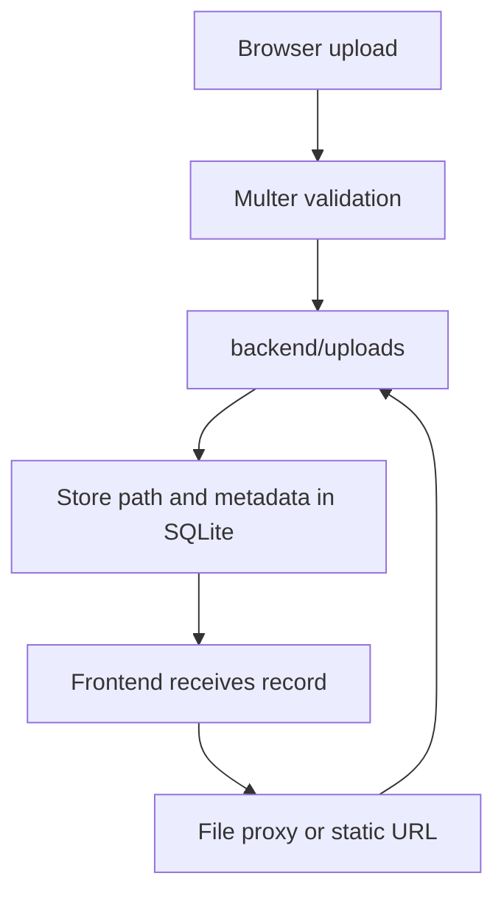

# File Storage

The current implementation uses local filesystem storage under `backend/uploads`. This is acceptable for local development but not ideal for production launch.

## Upload Categories

| Category | Endpoint | Current folder | Max size | Access pattern |
| --- | --- | --- | --- | --- |
| Study materials | `POST /api/v1/study-materials` | `backend/uploads/` | 50 MB | Streamed through `/api/v1/files/:studyMaterialId`. |
| Resources | `POST /api/v1/resources` | `backend/uploads/resources/` | 25 MB | Static `/uploads/resources/...` and `/resources/:id/file`. |
| Syllabus | `POST /api/v1/syllabus` | `backend/uploads/syllabus/` | 20 MB | Static `/uploads/syllabus/...` and `/syllabus/:id/file`. |
| Avatars | `PUT /api/v1/auth/updateavatar` | `backend/uploads/avatars/` | 5 MB | Static `/uploads/avatars/...`. |
| Study content | `POST /api/v1/content` | `backend/uploads/content/` | 100 MB | `/content/:id/file`. |

## Current Storage Flow



## Study Material Files

Handled by:

```text
backend/src/routes/studyMaterialRoutes.js
backend/src/routes/fileRoutes.js
backend/src/utils/fileProxy.js
```

Allowed extensions:

| Extension | Stored type |
| --- | --- |
| `.pdf` | `PDF` |
| `.ppt` | `PPT` |
| `.pptx` | `PPT` |
| `.docx` | `DOCX` |
| `.md` | `Markdown` |

Access rules:

- Approved material files are public through `/api/v1/files/:studyMaterialId`.
- Pending/rejected material files are available only to admins through the file proxy.
- The raw `backend/uploads/` root is not statically served by the active app.

## Resource Files

Handled by:

```text
backend/src/routes/resourceRoutes.js
```

Allowed extensions:

- `.pdf`
- `.doc`
- `.docx`
- `.ppt`
- `.pptx`
- `.md`
- `.markdown`
- `.txt`

Access rules:

- Resource records are public only when approved through `/api/v1/resources`.
- Uploaded resource files are also statically served from `/uploads/resources`.

Launch concern:

- Static resource file serving can expose a file if someone knows the URL, even if future status logic becomes private. Move private content behind signed URLs or authenticated proxy access.

## Syllabus Files

Handled by:

```text
backend/src/routes/syllabusRoutes.js
```

Allowed extensions:

- `.pdf`
- `.md`
- `.markdown`
- `.txt`

Behavior:

- PDF files are saved to disk and path is stored in `syllabi.content_url`.
- Markdown/text uploads are read into memory and stored directly in `syllabi.content_url`.
- Syllabus files are public by product design.

## Avatar Files

Handled by:

```text
backend/src/controllers/authController.js
```

Allowed MIME types:

- `image/jpeg`
- `image/png`
- `image/webp`
- `image/gif`

Behavior:

- User crops image client-side.
- Backend stores avatar in `backend/uploads/avatars`.
- Backend deletes previous local avatar when replaced.

## File Proxy Safety

`backend/src/utils/fileProxy.js`:

- Normalizes stored upload paths.
- Rejects external URLs.
- Verifies resolved file stays inside upload root.
- Supports required folder prefix for syllabus/resources.
- Streams file with content type and inline disposition.

This protects against common path traversal issues in the proxy route.

## Production Storage Problem

Local storage fails under:

- Serverless deployments with ephemeral filesystems.
- Horizontal scaling with multiple backend instances.
- Container redeploys without persistent volumes.
- Disaster recovery needs.
- CDN distribution needs.

## Production Storage Recommendation

Move uploads to object storage:

| Need | Recommendation |
| --- | --- |
| Durable storage | S3, Cloudflare R2, Supabase Storage, DigitalOcean Spaces, or similar. |
| Private pending files | Signed URLs or authenticated proxy download. |
| Public approved files | Public CDN URL or signed short-lived URL. |
| Virus scanning | Queue scan job before approval. |
| Metadata | Store object key, bucket, mime type, size, checksum. |
| Backups | Enable bucket versioning or scheduled backup. |

## Migration Plan

1. Add storage abstraction module.
2. Keep local adapter for development.
3. Add object-storage adapter for production.
4. Store `storage_provider`, `storage_key`, and `checksum` columns.
5. Migrate existing local files to object storage.
6. Update file proxy to read from object storage.
7. Stop serving private upload folders statically.

## Launch Checklist

- [ ] Choose object storage provider.
- [ ] Add environment variables for bucket credentials.
- [ ] Add upload checksum and virus scan plan.
- [ ] Enforce MIME sniffing, not only extension checks.
- [ ] Add lifecycle policy for deleted/orphaned files.
- [ ] Add backup and restore process.
- [ ] Add CDN caching for public files.
