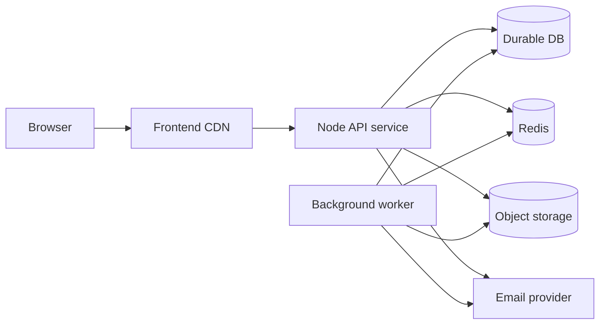

# Production Readiness And Launch Plan

Goal:

> Launch NMU Study Hub successfully to real students, faculty, and administrators.

This document is the production-readiness checklist and execution plan.

## Launch Readiness Summary

| Area | Current state | Launch readiness |
| --- | --- | --- |
| Product core | Strong MVP modules exist. | Needs UX cleanup and onboarding. |
| Frontend | Builds successfully with warnings. | Needs route guard, token refresh, bundle optimization. |
| Backend | Core APIs work and have basic hardening. | Needs tests, observability, distributed limits. |
| Database | SQLite migrations exist. | Needs backup/restore and migration policy. |
| File storage | Local filesystem. | Not production-ready for real scale. |
| Auth | OTP, JWT, refresh rotation. | Needs password reset and token storage hardening. |
| DevOps | Basic local and Vercel-style config. | Needs real hosting architecture. |
| Launch ops | Not documented before this file. | Needs owner, support, rollout plan. |

## Remaining Changes Required For Production

### Product

- Clarify navigation taxonomy:
  - Resources
  - Study Stock
  - Syllabus
  - Notes
  - Uploads
- Replace profile notes placeholder with real notes entry point.
- Add uploader-facing rejection reason display.
- Add onboarding flows for students, faculty, and admins.
- Add content guidelines for uploads.
- Add support/contact flow.

### Frontend

- Add centralized API client:
  - Attach access token.
  - Refresh on 401.
  - Retry original request once.
  - Logout only after refresh fails.
- Move access token out of `localStorage`.
- Add route guards for:
  - Authenticated-only pages.
  - Admin-only pages.
  - Faculty-only pages.
  - Student-facing notes/profile areas.
- Code split heavy modules:
  - Notes editor.
  - Admin dashboard.
  - Shiki syntax highlighting.
  - Faculty dashboard.
- Standardize loading, empty, and error states.
- Add accessibility QA:
  - Keyboard navigation.
  - Focus states.
  - Dialog labels.
  - Color contrast.
  - Screen reader names.

### Backend

- Add request schemas for notes and preferences.
- Add pagination to list endpoints.
- Add server-side search.
- Add password reset endpoints.
- Add email change verification.
- Add admin audit logs.
- Add structured logging.
- Add tests for all critical routes.
- Replace in-memory limiter with Redis-backed limiter.
- Add file scanning and MIME sniffing.
- Add OpenAPI spec.

### Database

- Define production database hosting.
- Add backup schedule and retention.
- Add restore runbook.
- Add migration policy:
  - Run migrations before app deploy.
  - Backup before migration.
  - No automatic destructive migrations on boot.
- Add audit log table.
- Validate note tree parent cycles.
- Add search indexes or FTS.

### Storage

- Move uploads to object storage.
- Add storage abstraction:
  - Local adapter for development.
  - Object adapter for production.
- Add object keys and checksum metadata.
- Add signed URLs for private/pending files.
- Add CDN for approved public assets.
- Add orphan cleanup job.

## Deployment Readiness Checklist

### Environment

- [ ] `NODE_ENV=production`
- [ ] Strong `JWT_ACCESS_SECRET`
- [ ] Strong `JWT_REFRESH_SECRET`
- [ ] `CORS_ORIGINS` set to production frontend URL only.
- [ ] SMTP provider configured.
- [ ] Redis configured for cache, queue coordination, and rate limits.
- [ ] Object storage credentials configured.
- [ ] Admin seed credentials rotated after first admin setup.
- [ ] Frontend `VITE_API_URL` points to production API.

### Hosting

- [ ] Choose hosting model:
  - Long-running Node backend, recommended for current code.
  - Serverless only after storage and worker redesign.
- [ ] Configure HTTPS.
- [ ] Configure custom domain.
- [ ] Configure CDN for frontend assets.
- [ ] Configure backend health checks.
- [ ] Configure persistent logs.
- [ ] Configure deployment rollback.

### Database

- [ ] Production DB path or managed DB selected.
- [ ] Migration job runs separately from web startup.
- [ ] Backups scheduled.
- [ ] Restore tested.
- [ ] Monitoring for DB file size and query latency.

### Storage

- [ ] Object storage bucket created.
- [ ] Private/public access model documented.
- [ ] Upload size limits confirmed.
- [ ] File scanning strategy defined.
- [ ] Lifecycle policy for deleted/orphaned objects.

### Security

- [ ] Access-token storage hardened.
- [ ] Password reset implemented.
- [ ] Distributed rate limiting implemented.
- [ ] Admin audit logs implemented.
- [ ] CSP reviewed.
- [ ] Upload MIME sniffing added.
- [ ] Dependency audit run.
- [ ] Secrets not committed.

### Testing

- [ ] Unit tests for validation helpers and service logic.
- [ ] Integration tests for auth.
- [ ] Integration tests for admin authorization.
- [ ] Integration tests for upload approval.
- [ ] Integration tests for file access permissions.
- [ ] Integration tests for notes CRUD.
- [ ] E2E tests for student signup to browsing.
- [ ] E2E tests for faculty approval and upload.
- [ ] E2E tests for admin moderation.

## Performance Optimizations

### Immediate

- Add pagination to:
  - Approved materials.
  - Pending/rejected materials.
  - Resources.
  - Syllabus.
  - Notes.
  - Feedback.
- Debounce search inputs and move heavy search to backend.
- Lazy load:
  - Notes editor.
  - Admin pages.
  - Faculty pages.
  - Markdown/code highlighting.
- Cache public academic content with safe TTLs.

### Medium Term

- Add SQLite FTS for syllabus, topics, resources, and study materials.
- Add CDN caching for public files.
- Add response compression.
- Add image optimization for avatars/covers.
- Add query timing logs.

### Future Scale

- Move from SQLite to Postgres if:
  - Concurrent writes grow.
  - Multiple backend instances are required.
  - Reporting/search requirements expand.
- Use dedicated search service if FTS is not enough.
- Use queue workers for email, file scanning, thumbnailing, notifications, and analytics.

## Security Improvements

### Before Launch

- Move access token to memory.
- Use refresh cookie to restore sessions.
- Add password reset.
- Add Redis-backed rate limiting.
- Add audit logs for:
  - Login attempts.
  - Admin approvals/rejections.
  - User deletion.
  - Resource/syllabus changes.
- Validate notes and preferences payloads.
- Add upload content scanning.
- Review static upload exposure.

### After Launch

- Add optional MFA for admins.
- Add suspicious login alerts.
- Add data export/delete request workflow.
- Add content takedown workflow.
- Add regular dependency audit schedule.

## DevOps And Hosting Considerations

### Recommended Initial Production Architecture

### Hosting Recommendation

For current code, prefer a long-running backend service over serverless because:

- Job worker uses an interval loop.
- SQLite/local uploads assume process and filesystem continuity.
- In-memory fallbacks are process-local.

Serverless can be used only after:

- Uploads move to object storage.
- Jobs move to external queue/worker.
- SQLite moves to durable hosted DB or serverless-compatible DB.

## User Onboarding And Launch Preparation

### Student Onboarding

- Show first-run checklist:
  - Select branch and year.
  - Browse syllabus.
  - Open study stock.
  - Create first note.
  - Bookmark first resource.
- Add "How to use" links in relevant empty states.

### Faculty Onboarding

- Explain approval status clearly.
- Show what faculty can do before and after approval.
- Provide upload quality guidelines.
- Provide feedback/rating guidelines.

### Admin Onboarding

- Add first admin setup checklist:
  - Confirm SMTP.
  - Approve initial faculty.
  - Add syllabus.
  - Review pending content.
  - Check feedback queue.
  - Test file preview.

### Launch Content Prep

- Seed accurate subject/unit/topic data.
- Add syllabus for priority branches/semesters.
- Add starter resources and sample approved uploads.
- Prepare FAQ and support process.
- Prepare privacy policy and terms.
- Decide moderation SLA.

## Suggested Launch Phases

### Phase 1: Internal QA

- Admin team and developers only.
- Test auth, upload, approval, notes, file previews.
- Validate backups and restore.

### Phase 2: Closed Beta

- 20 to 50 students.
- 3 to 5 faculty users.
- Collect feedback through platform feedback module.
- Track errors and missing content.

### Phase 3: Department Launch

- One branch or semester.
- Add real syllabus and material.
- Monitor traffic, upload volume, and moderation queue.

### Phase 4: Full Launch

- All target branches/semesters.
- Announce with onboarding guide.
- Monitor metrics daily for first two weeks.

## Final Launch Gate

Do not launch publicly until these are true:

- [ ] Critical auth flows tested.
- [ ] Upload approval flow tested.
- [ ] File storage is durable.
- [ ] Email delivery works.
- [ ] Database backup and restore are tested.
- [ ] Admin can moderate safely.
- [ ] Students can recover passwords.
- [ ] Production logs and error tracking are active.
- [ ] Terms, privacy, and content policy are available.
