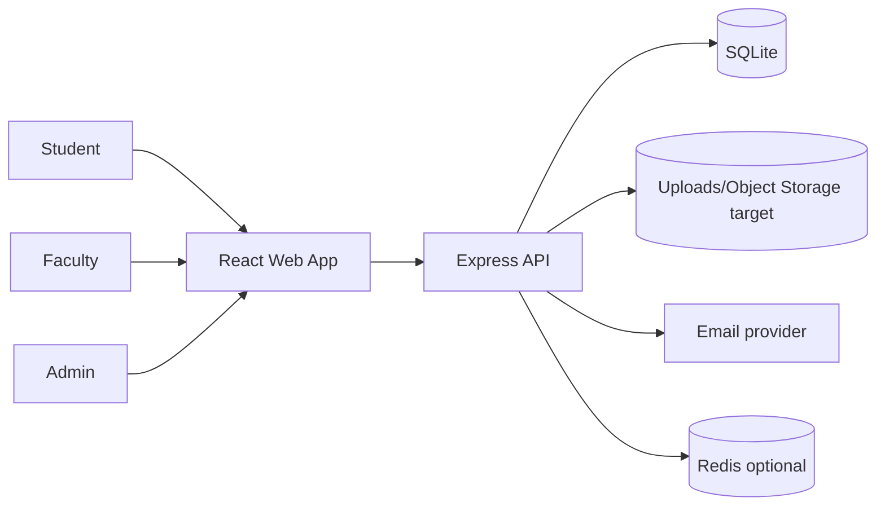
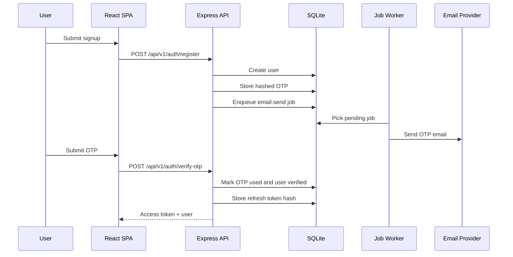
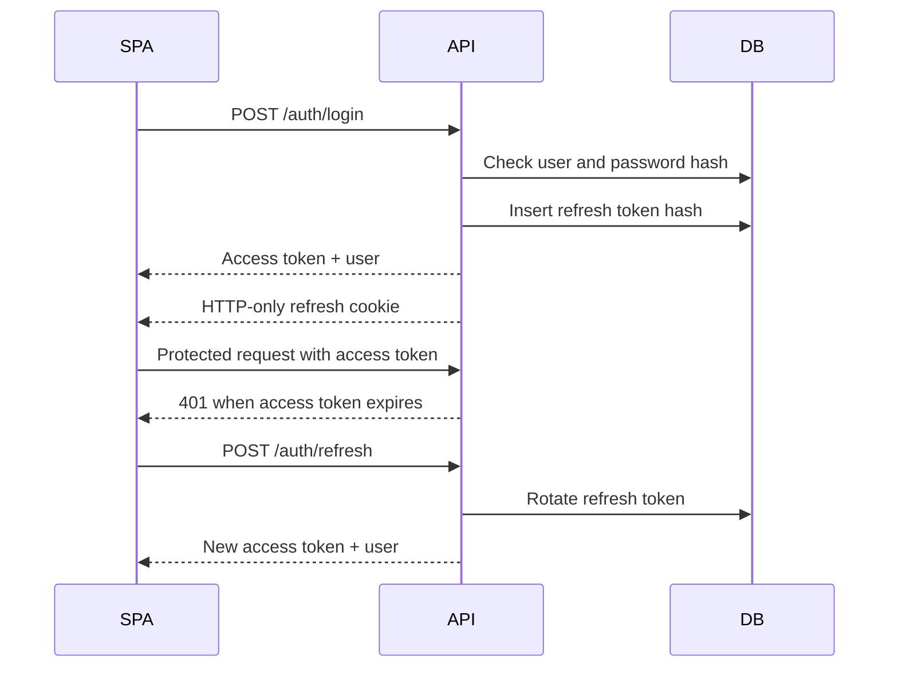
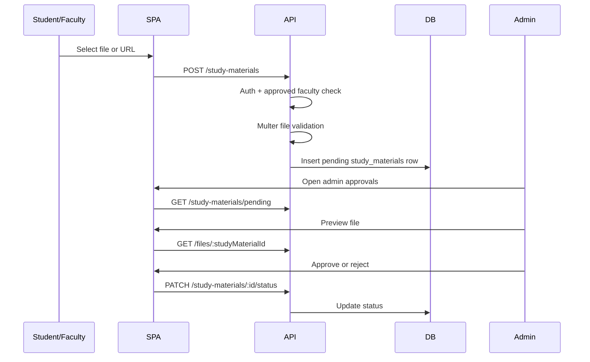
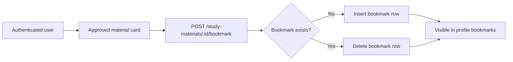
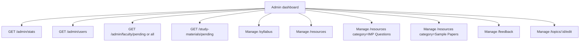
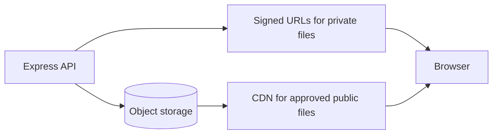
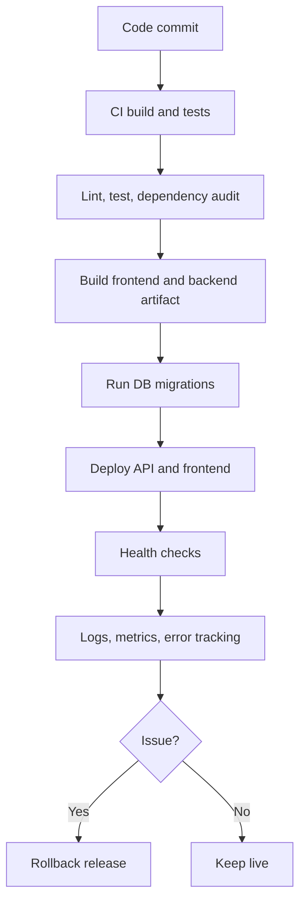
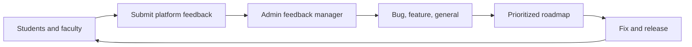

# Application Flow Diagrams

This document provides diagram-first explanations of the main NMU Study Hub flows.

## System Context



## Role-Based Navigation

```mermaid
flowchart TD
    Start[User opens app] --> HasSession{Stored session?}
    HasSession -->|No| Public[Public routes: Home, Resources, Study Stock, Search, Login, Signup]
    HasSession -->|Yes| Role{Role Guard}
    Role -->|Student| StudentHome[/dashboard/student: Dashboard, Profile, Uploads, Add Content, Bookmarks, Notes]
    Role -->|Faculty| FacultyDash[/dashboard/faculty: Dashboard, Upload, Profile]
    Role -->|Admin| AdminDash[/admin: Dashboard, Syllabus, Resources, IMP Questions, Sample Papers, Users, Approvals, Feedback]
```

Current issue:

- Frontend route guards depend on localStorage and should be replaced with server-verified guard plus refresh-token recovery.

## Signup And OTP Verification



## Login And Refresh



Current issue:

- Backend refresh exists, but frontend needs centralized refresh-on-401 retry.

## Academic Browsing

```mermaid
flowchart TD
    Resources[/resources] --> Select[Select branch and semester]
    Select --> Subjects[GET /subjects]
    Subjects --> SubjectPage[Subject dashboard]
    SubjectPage --> Units[GET /subjects/:id/units]
    Units --> Topic[GET /topics/:id]
    Topic --> Render[Render Markdown topic]
```

## Study Material Upload And Approval



## Bookmark Flow



## Notes Workspace Flow

```mermaid
flowchart TD
    Notes[/notes] --> Load[GET /notes]
    Load --> Sidebar[Build sidebar tree]
    Sidebar --> Select[Select note]
    Select --> Editor[TipTap editor]
    Editor --> Debounce[Debounced autosave]
    Debounce --> Save[PUT /notes/:id]
    Save --> DB[(student_notes)]
    Sidebar --> Favorite[Toggle favorite]
    Sidebar --> Trash[Move to trash]
    Editor --> Metadata[Icon, cover, font, full width]
    Metadata --> Save
```

Current notes risks:

- No conflict resolution.
- No parent-cycle prevention.
- Note payload validation needs tightening.

## Admin Management Flow



## File Access Flow

```mermaid
flowchart TD
    Request[File request] --> Type{File type}
    Type --> StudyMaterial[/files/:studyMaterialId]
    Type --> Syllabus[/syllabus/:id/file]
    Type --> Resource[/resources/:id/file or static URL]
    StudyMaterial --> Status{Approved?}
    Status -->|Yes| Stream[Stream file]
    Status -->|No| AdminCheck{Admin?}
    AdminCheck -->|Yes| Stream
    AdminCheck -->|No| Forbidden[403]
    Syllabus --> Stream
    Resource --> Stream
```

Production target:



## Production Deployment Flow



## Launch User Feedback Loop


