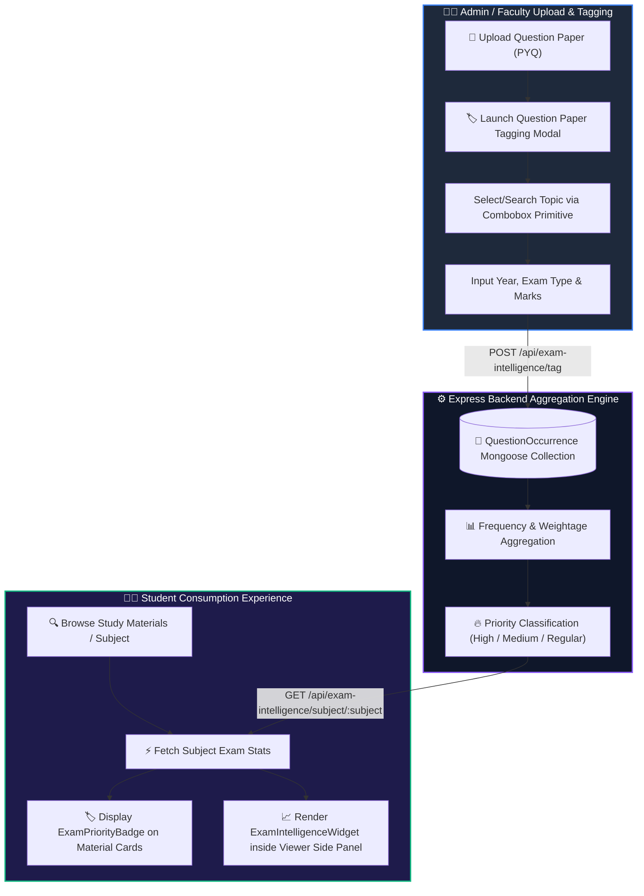
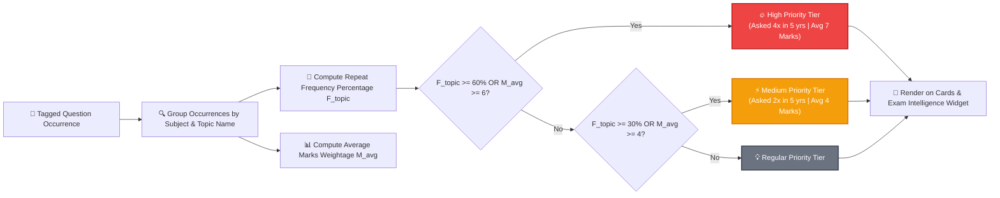

# Exam-Pattern Intelligence Feature Specification & Workflow

Updated: 2026-08-04  
Status: Implemented & Integrated

---

## 1. Executive Summary & Value Proposition

**Exam-Pattern Intelligence** is an analytical feature built for the **NMU Study Hub** platform. It analyzes past university question papers (PYQs) to extract recurring topics, question mark weightages, and historical frequencies.

### Key Benefits
- **Targeted Study for Students**: Highlights high-yield topics (80/20 rule) so students know where to focus during exam preparation.
- **Closed-Data Moat**: Relies on specific NMU university examination records that cannot be replicated by general LLMs or search engines.
- **Zero AI Expense**: Powered by statistical analysis over structured PYQ question tagging without third-party API costs.

---

## 2. Mathematical Formulas & Logic

The system computes historical repeat probabilities and classifies topics into three **Priority Tiers** based on mathematical thresholds:

### A. Topic Repeat Frequency Percentage ($F_{\text{topic}}$)

$$F_{\text{topic}} = \left( \frac{Y_{\text{topic}}}{Y_{\text{total}}} \right) \times 100$$

Where:
- $Y_{\text{topic}}$ = Total unique examination years in which the topic appeared.
- $Y_{\text{total}}$ = Total unique past papers analyzed for the subject (minimum 1).

---

### B. Average Marks Weightage ($M_{\text{avg}}$)

$$M_{\text{avg}} = \frac{\sum \text{Marks}_{\text{topic}}}{Y_{\text{topic}}}$$

Where:
- $\sum \text{Marks}_{\text{topic}}$ = Cumulative marks allocated to questions on this topic across all papers.

---

### C. Priority Tier Classification Rule

$$\text{Priority Tier} = \begin{cases} 
\mathbf{High \ (🔥)}, & \text{if } F_{\text{topic}} \ge 60\% \quad \text{OR} \quad M_{\text{avg}} \ge 6 \\
\mathbf{Medium \ (⚡)}, & \text{if } 30\% \le F_{\text{topic}} < 60\% \quad \text{OR} \quad 4 \le M_{\text{avg}} < 6 \\
\mathbf{Regular \ (💡)}, & \text{otherwise}
\end{cases}$$

---

## 3. Application Flow Diagrams

### Diagram 1: System Workflow (Upload ➔ Tag ➔ Aggregate ➔ Display)



---

### Diagram 2: Priority Classification Decision Tree



---

## 4. Database Schema Specification

### `QuestionOccurrence` Schema (`app/backend/models/QuestionOccurrence.js`)

| Field Name | Type | Constraints | Description |
| --- | --- | --- | --- |
| `_id` | ObjectId | Auto Primary Key | Unique tag occurrence record ID. |
| `subject` | String | Required, Trimmed, Indexed | Name of academic subject (e.g. `Data Structures`). |
| `topic` | String | Required, Trimmed, Indexed | Topic or unit name (e.g. `Linked List`). |
| `year` | Number | Required | Examination year (e.g. `2023`). |
| `examType` | String | Enum: `['End Sem', 'Mid Sem', 'Re-Exam']` | Type of examination (default: `End Sem`). |
| `marks` | Number | Default: `0` | Marks allocated to question (e.g. `7`). |
| `paperId` | ObjectId | Ref: `StudyMaterial`, Optional | Reference to uploaded PYQ file. |
| `questionNumber` | String | Trimmed, Optional | Question label (e.g. `Q1(a)`). |
| `createdAt` | Date | Default: `Date.now` | Creation timestamp. |

---

## 5. API Endpoints

### 1. `POST /api/exam-intelligence/tag`
Create a new question occurrence tag.
- **Request Body**:
  ```json
  {
    "subject": "Data Structures",
    "topic": "Linked List",
    "year": 2023,
    "examType": "End Sem",
    "marks": 7,
    "paperId": "66a8b1...",
    "questionNumber": "Q2(a)"
  }
  ```
- **Response**: `201 Created` with saved occurrence payload.

---

### 2. `GET /api/exam-intelligence/subject/:subject`
Fetch aggregated frequency statistics and priority classification for a subject.
- **Response**:
  ```json
  {
    "success": true,
    "subject": "Data Structures",
    "totalPapersAnalyzed": 5,
    "yearsAnalyzed": [2023, 2022, 2021, 2020, 2019],
    "topics": [
      {
        "topic": "Linked List",
        "occurrencesCount": 6,
        "yearsCount": 4,
        "totalMarks": 28,
        "avgMarks": 7.0,
        "frequencyPercent": 80,
        "priority": "high",
        "yearsList": [2023, 2022, 2021, 2019]
      }
    ]
  }
  ```

---

### 3. `GET /api/exam-intelligence/paper/:paperId`
Fetch tags associated with a specific question paper file.

---

### 4. `DELETE /api/exam-intelligence/tag/:id`
Delete an incorrect or outdated topic tag.

---

## 6. Frontend Component Architecture

All UI components are built using `@/components/ui/` primitives without inline Tailwind class overrides on primitive elements:

| Component Name | Path | UI Primitives Used | Function |
| --- | --- | --- | --- |
| `ExamPriorityBadge` | `app/src/components/study-materials/ExamPriorityBadge.tsx` | `<Badge>` (`variant="destructive" \| "warning" \| "outline"`) | Renders priority badges on material cards and viewers. |
| `ExamIntelligenceWidget` | `app/src/components/study-materials/ExamIntelligenceWidget.tsx` | `<Card>`, `<Button>`, `<Input>`, `<Badge>`, `<Progress>`, `<Empty>`, `<Spinner>` | Renders subject frequency breakdown, progress bars, and stats. |
| `QuestionPaperTaggingModal` | `app/src/pages/admin/QuestionPaperTaggingModal.tsx` | `<Dialog>`, `<Button>`, `<Field>`, `<Input>`, `<NativeSelect>`, `<Combobox>` | Tagging interface for Admin/Faculty with searchable topic suggestions via `<Combobox>`. |
| `ExamIntelligencePage` | `app/src/pages/admin/ExamIntelligencePage.tsx` | `<Card>`, `<Badge>`, `<Button>`, `<Input>`, `<NativeSelect>` | Admin management section at `/admin/exam-intelligence`. |

---

## 7. Documentation Index & References

- Overview & Routing: [01-introduction.md](./01-introduction.md) & [README.md](./README.md)
- User Roles & Access: [02-user-types.md](./02-user-types.md)
- Backend APIs: [06-api-endpoints.md](./06-api-endpoints.md)
- Application Diagrams: [11-application-flow-diagrams.md](./11-application-flow-diagrams.md)
